<p align="center">
  
</p>


---

## 1. **How to Check the Total Number of ConfigMaps in the Environment**

To find the total number of ConfigMaps in your Kubernetes environment, use the following `kubectl` commands:

### **Linux**
```bash
kubectl get configmaps --all-namespaces --no-headers | wc -l
```
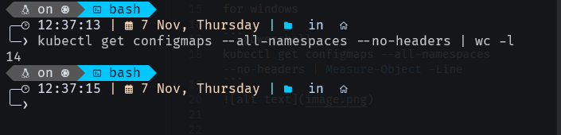

### **Windows**
```powershell
kubectl get configmaps --all-namespaces --no-headers | Measure-Object -Line
```
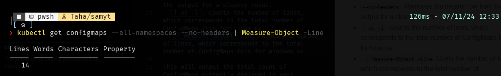

These commands list all ConfigMaps across all namespaces, remove headers for a cleaner output, and count the entries.

---

## 2. **Creating a ConfigMap with Specific Specifications**

To create a ConfigMap named `webapp-config-map` with the key-value pair `APP_COLOR=darkblue`, you can use either of the following methods:

### **Command-Line Creation**
```bash
kubectl create configmap webapp-config-map --from-literal=APP_COLOR=darkblue
```
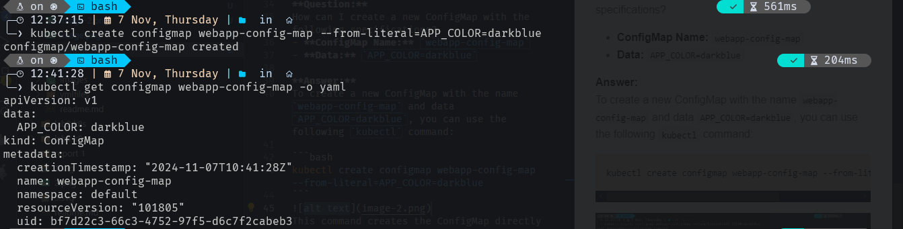

### **YAML File Creation**
1. Create a YAML file (e.g., `ymlfiles/q1/q1_config.yaml`):

   ```yaml
   apiVersion: v1
   kind: ConfigMap
   metadata:
     name: webapp-config-map
   data:
     APP_COLOR: darkblue
   ```

2. Apply the YAML file:

   ```bash
   kubectl apply -f ymlfiles/q1/q1_config.yaml
   ```

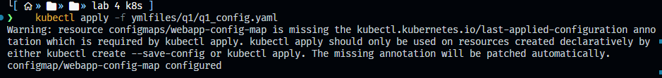

---

## 3. **Creating a Pod with Nginx Image Using ConfigMap**

To create a pod named `webapp-color` that uses the `nginx` image and references the `webapp-config-map` ConfigMap, follow these steps:

### **Pod YAML Definition**
Create a YAML file (e.g., `ymlfiles/q1/deploy.yaml`):

```yaml
apiVersion: v1
kind: Pod
metadata:
  name: webapp-color
spec:
  containers:
  - name: nginx
    image: nginx
    envFrom:
    - configMapRef:
        name: webapp-config-map
```

### **Explanation**
- `envFrom`: References the ConfigMap named `webapp-config-map`, setting `APP_COLOR` as an environment variable in the pod.

### **Applying the YAML**
Apply the configuration file to deploy the pod:

```bash
kubectl apply -f ymlfiles/q2/deploy.yaml
```
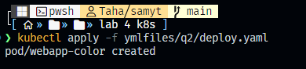

---

## 4. **Counting Secrets in the Kubernetes Environment**

To get the total number of Secrets in your Kubernetes cluster, use the following commands:

### **Linux**
```bash
kubectl get secrets --all-namespaces --no-headers | wc -l
```
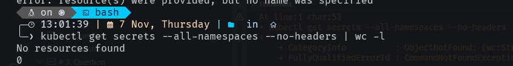

### **Windows**
```powershell
kubectl get secrets --all-namespaces --no-headers | Measure-Object -Line
```
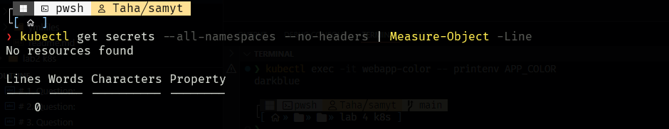

---

## 5. **Checking Secrets in `default-token`**

If no secrets are present in your Kubernetes environment, this check will output `0`, indicating that there are no secrets.


---

## 6. **Creating a `db-pod` with MySQL Image and Checking Pod Status**

To create a pod named `db-pod` with the image `mysql:5.7`, define and apply a YAML configuration:

### **Pod YAML Definition**
Create a YAML file (e.g., `ymlfiles/q3/deploy.yml`):

```yaml
apiVersion: v1
kind: Pod
metadata:
  name: db-pod
spec:
  containers:
  - name: mysql
    image: mysql:5.7
    ports:
    - containerPort: 3306
```

### **Applying the YAML**
```bash
kubectl apply -f ymlfiles/q3/deploy.yml
```

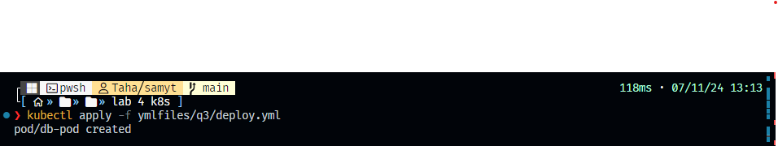

---

## 7. **Why the `db-pod` Status is Not Ready**

To find out why `db-pod` is not ready, check the pod logs:

```bash
kubectl logs db-pod
```

```
❯ kubectl logs db-pod
2024-11-07 11:24:36+00:00 [Note] [Entrypoint]: Entrypoint script for MySQL Server 5.7.44-1.el7 started.
2024-11-07 11:24:36+00:00 [Note] [Entrypoint]: Switching to dedicated user 'mysql'
2024-11-07 11:24:36+00:00 [Note] [Entrypoint]: Entrypoint script for MySQL Server 5.7.44-1.el7 started.
2024-11-07 11:24:36+00:00 [ERROR] [Entrypoint]: Database is uninitialized and password option is not specified     
    You need to specify one of the following as an environment variable:
    - MYSQL_ROOT_PASSWORD
    - MYSQL_ALLOW_EMPTY_PASSWORD
    - MYSQL_RANDOM_ROOT_PASSWORD
```

It appears that you need to define one of the following environment variables: `MYSQL_ROOT_PASSWORD`, `MYSQL_ALLOW_EMPTY_PASSWORD`, or `MYSQL_RANDOM_ROOT_PASSWORD`.

---

## 8. **Creating a New Secret `db-secret` with Specific Data**

You can create the secret via the command line or with a YAML file.

### **Command-Line Creation**
```bash
kubectl create secret generic db-secret \
  --from-literal=MYSQL_DATABASE=SQI01 \
  --from-literal=MYSQL_USER=user1 \
  --from-literal=MYSQL_PASSWORD=password \
  --from-literal=MYSQL_ROOT_PASSWORD=password123
```

### **YAML File Creation**
Create a YAML file (e.g., `ymlfiles/q4/secrets.yml`):

```yaml
apiVersion: v1
kind: Secret
metadata:
  name: db-secret
type: Opaque
data:
  MYSQL_DATABASE: c3FJMDE=
  MYSQL_USER: dXNlcjE=
  MYSQL_PASSWORD: cGFzc3dvcmQ=
  MYSQL_ROOT_PASSWORD: cGFzc3dvcmQxMjM=
```

> **Note**: Values in Kubernetes secrets must be base64-encoded.

To apply the secret:
```bash
kubectl apply -f ymlfiles/q4/secrets.yml
```
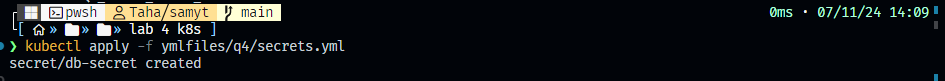

To confirm the secret was created:

```bash
kubectl get secret db-secret -o yaml
```

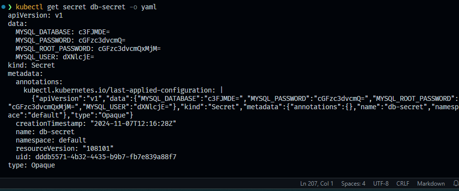

---

## 9. **Configuring `db-pod` to Use the New Secret**

Modify the `db-pod` YAML to load environment variables from `db-secret`:

### **YAML Definition for `db-pod` Using `db-secret`**
Save the following YAML in `ymlfiles/q5/deploy_with_secrets.yml`:

```yaml
apiVersion: v1
kind: Pod
metadata:
  name: db-pod
spec:
  containers:
  - name: mysql
    image: mysql:5.7
    ports:
    - containerPort: 3306
    env:
    - name: MYSQL_DATABASE
      valueFrom:
        secretKeyRef:
          name: db-secret
          key: MYSQL_DATABASE
    - name: MYSQL_USER
      valueFrom:
        secretKeyRef:
          name: db-secret
          key: MYSQL_USER
    - name: MYSQL_PASSWORD
      valueFrom:
        secretKeyRef:
          name: db-secret
          key: MYSQL_PASSWORD
    - name: MYSQL_ROOT_PASSWORD
      valueFrom:
        secretKeyRef:
          name: db-secret
          key: MYSQL_ROOT_PASSWORD
```

### **Applying the Configuration**
1. Delete the existing `db-pod`:

   ```bash
   kubectl delete pod db-pod
   ```
   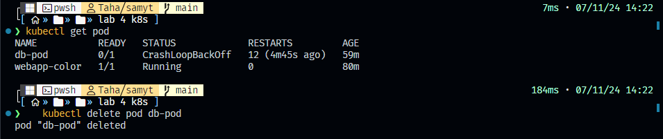

2. Apply the updated YAML file:

   ```bash
   kubectl apply -f ymlfiles/q5/deploy_with_secrets.yml
   ```
   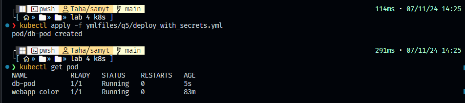

To verify:

```bash
kubectl get pods db-pod
```

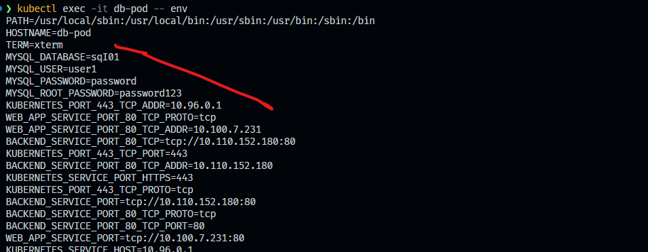

---

## 10. **Creating a Multi-Container Pod**

To create a pod with two containers (`lemon` using `busybox` and `gold` using `redis`), define the following YAML in `ymlfiles/q6/deploy.yml`:

```yaml
apiVersion: v1
kind: Pod
metadata:
  name: yellow
spec:
  containers:
  - name: lemon
    image: busybox
    command: ["sleep", "3600"]
  - name: gold
    image: redis
    ports:
    - containerPort: 6379
```

### **Applying the Configuration**
```bash
kubectl apply -f ymlfiles/q6/deploy.yml
```


Verify pod status:

```bash
kubectl get pods yellow
```


To list container names and images in the pod:

```bash
kubectl get pod yellow -

o jsonpath="{.spec.containers[*].name} {.spec.containers[*].image}"
```

---

End of Report.


## 11. Create a Pod `red` with the Redis image and an InitContainer that uses the BusyBox image and sleeps for 20 seconds

To create a pod with the `redis` image and an `initContainer` that uses the `busybox` image and sleeps for 20 seconds, you can define the pod as follows in file `ymlfiles/q7/deploy_red.yml`:

## YAML Definition for Pod `red` with InitContainer

```yaml
apiVersion: v1
kind: Pod
metadata:
  name: red
spec:
  initContainers:
  - name: init-sleep
    image: busybox
    command: ["sleep", "20"]
  containers:
  - name: redis
    image: redis
    ports:
    - containerPort: 6379
```

Apply the YAML file to create the pod:

   ```bash
   kubectl apply -f ymlfiles/q7/deploy_red.yml
   ```
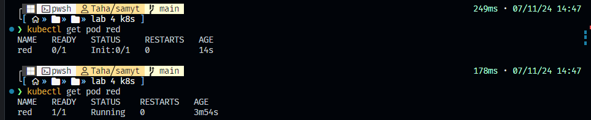

## 12. Create a Pod named `print-envars-greeting` with the specified environment variables and command

To create a pod named `print-envars-greeting` that echoes the environment variables, use the following YAML definition in file `ymlfiles/q8/deploy.yml`:

 YAML Definition for `print-envars-greeting` Pod in file `ymlfiles/q8/deploy.yml`

```yaml
apiVersion: v1
kind: Pod
metadata:
  name: print-envars-greeting
spec:
  containers:
  - name: print-env-container
    image: bash
    env:
    - name: GREETING
      value: "welcome to"
    - name: COMPANY
      value: "Track"
    - name: GROUP
      value: "DevOps"
    command: ["bash", "-c", 'echo "$GREETING $COMPANY $GROUP"']
```

1. Apply the YAML file to create the pod:

   ```bash
   kubectl apply -f ymlfiles/q8/deploy.yml
   ```

2. After the pod starts, check the output using:

   ```bash
   kubectl logs -f print-envars-greeting
   ```
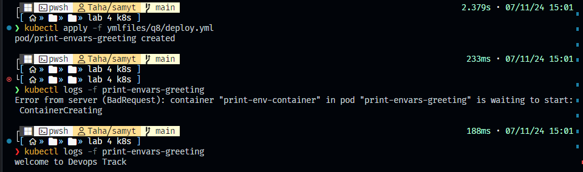

This will print the message: `welcome to Devops Track`.

## 13. Where is the default kubeconfig file located in the current environment?

By default, the Kubernetes `kubeconfig` file is located at:

```bash
~/.kube/config
```
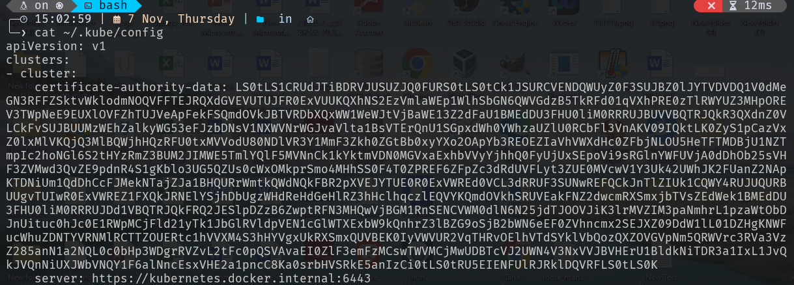
You can verify this location by checking the `KUBECONFIG` environment variable:

```bash
echo $KUBECONFIG
```

If it's not set, Kubernetes uses the default location (`~/.kube/config`).

## 14. How many clusters are defined in the default kubeconfig file?

To check how many clusters are defined in the default `kubeconfig` file, you can run:

```bash
kubectl config get-clusters
```

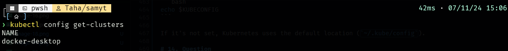
This will list all clusters defined in your `kubeconfig` file. You can count the number of clusters by running:

```bash
kubectl config get-clusters --no-headers | wc -l
```

## 15. What is the user configured in the current context?

To check which user is configured in the current Kubernetes context, you can run the following command:

```bash
kubectl config current-context
```
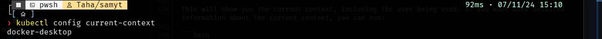
This will show you the current context, including the user being used. If you want more detailed information about the current context, you can run:

```bash
kubectl config view --minify
```
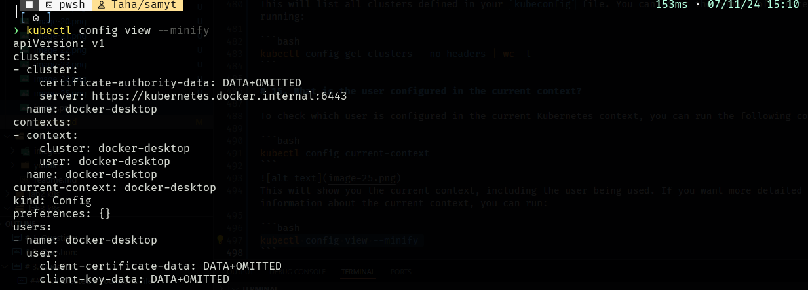
This will show detailed information, including the user, cluster, and namespace of the current context.

---

## 16. Create a Persistent Volume (PV) with the given specifications


#### YAML Definition for Persistent Volume in file `ymlfiles/q8/log_volume.yml`

```yaml
apiVersion: v1
kind: PersistentVolume
metadata:
  name: pv-log
spec:
  storageClassName: manual

  capacity:
    storage: 100Mi  
  accessModes:
    - ReadWriteMany
  hostPath:
    path: /hi_im_here  
    type: DirectoryOrCreate
```

Apply the YAML file to create the Persistent Volume:

   ```bash
   kubectl apply -f ymlfiles/q8/log_volume.yml
   ```
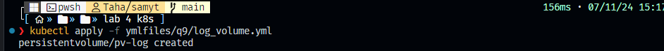
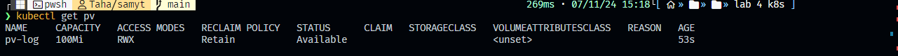


## 17. Create a Persistent Volume Claim (PVC) with the given specifications

To create a Persistent Volume Claim named `claim-log-1` with a storage request of 50Mi and ReadWriteMany access mode,

#### YAML Definition for Persistent Volume Claim in file `ymlfiles/q10/pvc.yml`

```yaml
apiVersion: v1
kind: PersistentVolumeClaim
metadata:
  name: claim-log-1
spec:
  storageClassName: manual
  accessModes:
    - ReadWriteMany
  resources:
    requests:
      storage: 50Mi
  volumeName: pv-log  
```


Apply the YAML file to create the PVC:

   ```bash
   kubectl apply -f ymlfiles/q10/pvc.yml
   ```
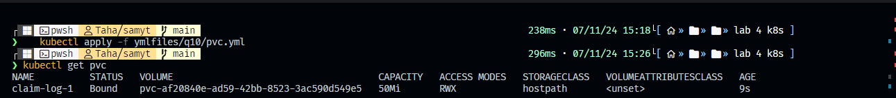
---

## 18. Create a webapp Pod to use the Persistent Volume Claim as its storage

To create a `webapp` pod using the `nginx` image and mounting the Persistent Volume Claim `claim-log-1` at `/var/log/nginx`, use the following YAML:

#### YAML Definition for the `webapp` Pod

```yaml
apiVersion: v1
kind: Pod
metadata:
  name: webapp
spec:
  containers:
  - name: nginx
    image: nginx
    volumeMounts:
    - mountPath: /var/log/nginx
      name: claim-log-1
  volumes:
  - name: claim-log-1
    persistentVolumeClaim:
      claimName: claim-log-1
```


1. Apply the YAML file to create the pod:

   ```bash
   kubectl apply -f ymlfiles/q11/webapp-pod.yaml
   ```
do not forget to expose port to host
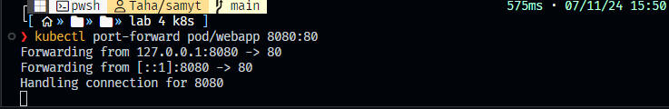


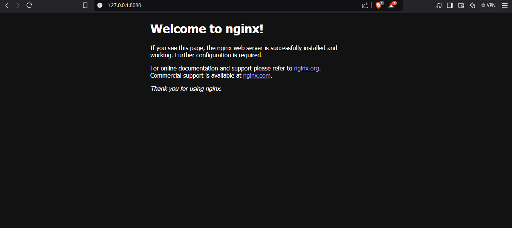
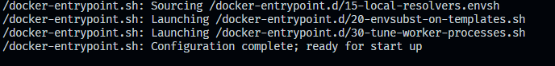
---

