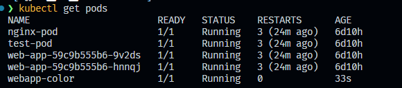
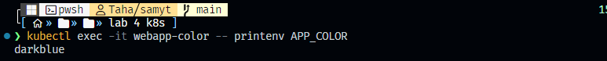
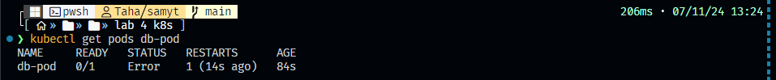
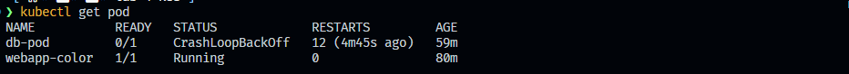

<p align="center">
  
</p>

# 1. **Question:**  
How can I find out the total number of ConfigMaps in my Kubernetes environment?

**Answer:**  
To find the total number of ConfigMaps in the environment, you can use the following `kubectl` command:

**for linux**
```bash
kubectl get configmaps --all-namespaces --no-headers | wc -l
```


**for windows**

```powershell
kubectl get configmaps --all-namespaces --no-headers | Measure-Object -Line
```


This command retrieves all ConfigMaps across all namespaces and counts the total number of entries. Here's a breakdown of the command:
- `kubectl get configmaps --all-namespaces`: Lists all ConfigMaps in every namespace.
- `--no-headers`: Removes the header row from the output for a cleaner count.
- `| wc -l`: Counts the number of lines, which corresponds to the total number of ConfigMaps this for linux os.
- ` | Measure-Object -Line` Cunts the number of lines, which corresponds to the total number of ConfigMaps this for windows os

This will output the total count of ConfigMaps currently deployed in your Kubernetes environment.

# 2. **Question:**  
create a new ConfigMap with the following specifications?  
- **ConfigMap Name:** `webapp-config-map`
- **Data:** `APP_COLOR=darkblue`

**Answer:**  
To create a new ConfigMap with the name `webapp-config-map` and data `APP_COLOR=darkblue`, you can use the following `kubectl` command:

```bash
kubectl create configmap webapp-config-map --from-literal=APP_COLOR=darkblue
```

This command creates the ConfigMap directly with the specified key-value pair.

Alternatively, you can create it using a YAML file:

1. **I Created a YAML file** (e.g., `ymlfiles/q1/q1_config.yaml`) with the following content:

   ```yaml
   apiVersion: v1
   kind: ConfigMap
   metadata:
     name: webapp-config-map
   data:
     APP_COLOR: darkblue
   ```

2. **Apply the YAML file** with:

   ```bash
   kubectl apply -f ymlfiles/q1/q1_config.yaml
   ```

This  added the `webapp-config-map` ConfigMap with the specified data to your Kubernetes environment.

this is not error becuase i do the same config by comand line and then by yml files he want to compare two of them to know if something is change so he write the last status
 
# 3. Question

Create a webapp-color POD with nginx image and use the created ConfigMap


### 1. **I Created a Pod YAML File**  
I Created a YAML file (e.g., `ymlfiles/q1/deploy.yaml`) to define the pod and reference the `ConfigMap`.

```yaml
apiVersion: v1
kind: Pod
metadata:
  name: webapp-color
spec:
  containers:
  - name: nginx
    image: nginx
    envFrom:
    - configMapRef:
        name: webapp-config-map
```

### Explanation:
- **`envFrom`**: This references the `ConfigMap` named `webapp-config-map` and sets the values from the `ConfigMap` as environment variables inside the pod.
- The `nginx` container is defined as the main container, using the official `nginx` image.

### 2. **Apply the YAML File**  
Once you have created the YAML file, apply it using the `kubectl apply` command:

```bash
kubectl apply -f ymlfiles/q2/deploy.yaml
```


### 3. **Verify the Pod**  
To check if the pod was created successfully, you can use the following command:

```bash
kubectl get pods
```

### 4. **Check the Environment Variable in the Pod**  
To verify that the `ConfigMap` data (`APP_COLOR`) is set as an environment variable inside the pod, you can exec into the pod and print the environment variable:

```bash
kubectl exec -it webapp-color -- printenv APP_COLOR
```

This should output `darkblue`, which is the value from the `ConfigMap`.

By following these steps, you will create a pod named `webapp-color` that runs the `nginx` image and uses the `APP_COLOR` from the `ConfigMap` as an environment variable.

# 4. Question
How many Secrets exist on the system?

To check how many Secrets exist in your Kubernetes cluster, you can run the following command:

```bash
kubectl get secrets --all-namespaces --no-headers | wc -l
```

```powershell
kubectl get secrets --all-namespaces --no-headers | Measure-Object -Line
```

This command does the following:
- `kubectl get secrets --all-namespaces`: Lists all secrets in all namespaces.
- `--no-headers`: Removes the headers from the output.
- `wc -l`: Counts the number of lines (which corresponds to the number of secrets).

# 5. Question
How many secrets are defined in the default-token secret?

there is no secrets in k8s at all 


# 6. Question 
Create a POD called `db-pod` with the image `mysql:5.7`, then check the POD status

## i created yml file that create `db-pod` with image `mysql:5.7` in `ymlfiles/q3/deploy.yml`

```yml
apiVersion: v1
kind: Pod
metadata:
  name: db-pod
spec:
  containers:
  - name: mysql
    image: mysql:5.7
    ports:
    - containerPort: 3306

```

and i applied the yml file
```bash
kubectl apply -f ymlfiles/q3/deploy.yml
```
Once the pod is created, you can check its status by running:


```bash
kubectl get pods db-pod
```

# 7. Question 
Why the `db-pod` status is not ready?

to know why `db-pod` status is not ready the main way check logs
  ```bash
  kubectl logs db-pod
  ```
```
❯ kubectl logs db-pod
2024-11-07 11:24:36+00:00 [Note] [Entrypoint]: Entrypoint script for MySQL Server 5.7.44-1.el7 started.
2024-11-07 11:24:36+00:00 [Note] [Entrypoint]: Switching to dedicated user 'mysql'
2024-11-07 11:24:36+00:00 [Note] [Entrypoint]: Entrypoint script for MySQL Server 5.7.44-1.el7 started.
2024-11-07 11:24:36+00:00 [ERROR] [Entrypoint]: Database is uninitialized and password option is not specified     
    You need to specify one of the following as an environment variable:
    - MYSQL_ROOT_PASSWORD
    - MYSQL_ALLOW_EMPTY_PASSWORD
    - MYSQL_RANDOM_ROOT_PASSWORD
```
it is appear  we must defined `MYSQL_ROOT_PASSWORD` and `MYSQL_ALLOW_EMPTY_PASSWORD` and `MYSQL_RANDOM_ROOT_PASSWORD` in envirnment of

# 8. Question
8. Create a new secret named `db-secret` with the data given below:
 
you can create directly throught comand line
```bash
kubectl create secret generic db-secret \
  --from-literal=MYSQL_DATABASE=SQI01 \
  --from-literal=MYSQL_USER=user1 \
  --from-literal=MYSQL_PASSWORD=password \
  --from-literal=MYSQL_ROOT_PASSWORD=password123
```
**or create by yml**
YAML definition for the `db-secret` in file `ymlfiles/q4/secrets.yml`:

```yaml
apiVersion: v1
kind: Secret
metadata:
  name: db-secret
type: Opaque
data:
  MYSQL_DATABASE: c3FJMDE=           # Base64 encoded value of "SQI01"
  MYSQL_USER: dXNlcjE=               # Base64 encoded value of "user1"
  MYSQL_PASSWORD: cGFzc3dvcmQ=       # Base64 encoded value of "password"
  MYSQL_ROOT_PASSWORD: cGFzc3dvcmQxMjM= # Base64 encoded value of "password123"
```
> [!IMPORTANT]  
> Note:
> - The values for `MYSQL_DATABASE`, `MYSQL_USER`, `MYSQL_PASSWORD`, and `MYSQL_ROOT_PASSWORD` must be encoded in base64, as Kubernetes secrets store data in base64 format.
>  - To encode a value in base64, you can use the following command in Linux or macOS:
>
>    ```bash
>    echo -n "value" | base64
>   ```
>
>   For example:
>   ```bash
>   echo -n "SQI01" | base64
>   ```
>
>   This will output: `c3FJMDE=`

to apply it 
```bash
kubectl apply -f ymlfiles/q4/secrets.yml
```

This command creates a new secret called `db-secret` with the given key-value pairs.

To confirm the secret was created, you can run:

```bash
kubectl get secret db-secret -o yaml
```

This will display the secret in YAML format, with the values encoded in base64.


# 9. Configure `db-pod` to load environment variables from the newly created secret

To configure `db-pod` to load environment variables from the `db-secret` secret, you need to update the pod definition to reference the secret for the environment variables.

Here’s how you can modify the `db-pod` configuration in YAML to load the environment variables from the `db-secret`:

## YAML Definition for `db-pod` to use the `db-secret` in file `ymlfiles/q5/deploy_with_secrets` 

```yaml
apiVersion: v1
kind: Pod
metadata:
  name: db-pod
spec:
  containers:
  - name: mysql
    image: mysql:5.7
    ports:
    - containerPort: 3306
    env:
    - name: MYSQL_DATABASE
      valueFrom:
        secretKeyRef:
          name: db-secret
          key: MYSQL_DATABASE
    - name: MYSQL_USER
      valueFrom:
        secretKeyRef:
          name: db-secret
          key: MYSQL_USER
    - name: MYSQL_PASSWORD
      valueFrom:
        secretKeyRef:
          name: db-secret
          key: MYSQL_PASSWORD
    - name: MYSQL_ROOT_PASSWORD
      valueFrom:
        secretKeyRef:
          name: db-secret
          key: MYSQL_ROOT_PASSWORD
```

## Steps to apply this configuration:

1. **Save the updated configuration to a file** named `ymlfiles/q5/deploy_with_secrets.yml`.
2. **Delete the existing pod** (if it’s already running) to apply the changes:

   ```bash
   kubectl delete pod db-pod
   ```

3. **Recreate the pod** by applying the updated YAML file:

   ```bash
   kubectl apply -f ymlfiles/q5/deploy_with_secrets.yml
   ```

## Verifying the Pod Status:
Once the pod is recreated, you can verify that it’s running with the environment variables set correctly by checking the pod status:

```bash
kubectl get pods db-pod
```

To confirm that the environment variables are correctly set inside the container, you can check the pod's environment variables:

```bash
kubectl exec -it db-pod -- env
```

This will display all the environment variables, including the ones you configured from the secret.


