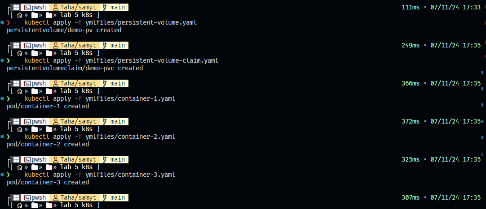
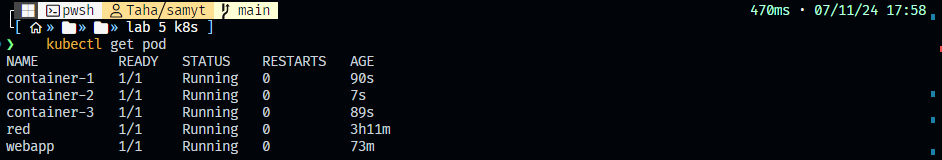
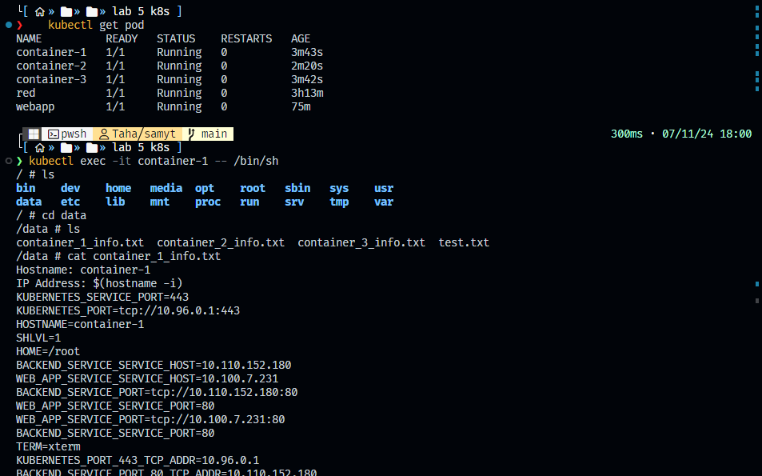

to remake lab1 on docker by k8s web 
1. **PersistentVolume**: Save this as `ymlfiles/persistent-volume.yaml`
2. **PersistentVolumeClaim**: Save this as `ymlfiles/persistent-volume-claim.yaml`
3. **Pods**: Save each pod as its own YAML file (`ymlfiles/container-1.yaml`, `ymlfiles/container-2.yaml`, and `container-3.yaml`)

### 1. `ymlfiles/persistent-volume.yaml`

```yaml
apiVersion: v1
kind: PersistentVolume
metadata:
  name: demo-pv
spec:
  capacity:
    storage: 100Mi
  accessModes:
    - ReadWriteMany
  persistentVolumeReclaimPolicy: Retain
  storageClassName: manual
  hostPath:
    path: /data   
```

### 2. `ymlfiles/persistent-volume-claim.yaml`

```yaml
apiVersion: v1
kind: PersistentVolumeClaim
metadata:
  name: demo-pvc
spec:
  accessModes:
    - ReadWriteMany
  storageClassName: manual
  resources:
    requests:
      storage: 50Mi
```

### 3. `ymlfiles/container-1.yaml`

```yaml
apiVersion: v1
kind: Pod
metadata:
  name: container-1
spec:
  containers:
    - name: container-1
      image: alpine
      tty: true
      volumeMounts:
        - mountPath: /data
          name: demo-volume
      command: ["/bin/sh", "-c"]
      args:
        - |
          echo 'Hostname: container-1' > /data/container_1_info.txt && \
          echo 'IP Address: $(hostname -i)' >> /data/container_1_info.txt && \
          env >> /data/container_1_info.txt && \
          while true; do \
            echo 'Test running' >> /data/test.txt; \
            sleep 5; \
          done
  volumes:
    - name: demo-volume
      persistentVolumeClaim:
        claimName: demo-pvc
```

### 4. `ymlfiles/container-2.yaml`

```yaml
apiVersion: v1
kind: Pod
metadata:
  name: container-2
spec:
  containers:
    - name: container-2
      image: alpine
      tty: true
      volumeMounts:
        - mountPath: /data
          name: demo-volume
      command: ["/bin/sh", "-c"]
      args:
        - |
          echo 'Hostname: container-1' > /data/container_2_info.txt && \
          echo 'IP Address: $(hostname -i)' >> /data/container_2_info.txt && \
          env >> /data/container_1_info.txt && \
          while true; do \
            echo 'Test running' >> /data/test.txt; \
            sleep 5; \
          done

    - name: demo-volume
      persistentVolumeClaim:
        claimName: demo-pvc
```

### 5. `ymlfiles/container-3.yaml`

```yaml
apiVersion: v1
kind: Pod
metadata:
  name: container-3
spec:
  containers:
    - name: container-3
      image: alpine
      tty: true
      volumeMounts:
        - mountPath: /data
          name: demo-volume
      command: ["/bin/sh", "-c"]
      args:
        - |
          echo 'Hostname: container-1' > /data/container_3_info.txt && \
          echo 'IP Address: $(hostname -i)' >> /data/container_3_info.txt && \
          env >> /data/container_1_info.txt && \
          while true; do \
            echo 'Test running' >> /data/test.txt; \
            sleep 5; \
          done
  volumes:
    - name: demo-volume
      persistentVolumeClaim:
        claimName: demo-pvc
```

### Deployment Steps

1. Apply each file in sequence to create the resources in your Kubernetes cluster:

   ```bash
   kubectl apply -f ymlfiles/persistent-volume.yaml
   kubectl apply -f ymlfiles/persistent-volume-claim.yaml
   kubectl apply -f ymlfiles/container-1.yaml
   kubectl apply -f ymlfiles/container-2.yaml
   kubectl apply -f ymlfiles/container-3.yaml
   ```
   



test

