<p align="center">
  
</p>

# 1. How many Namespaces exist on the system?

To list all namespaces, use:
```bash
kubectl get namespaces
```
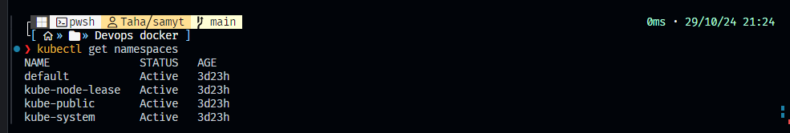

To count the namespaces:
```bash
kubectl get namespaces --no-headers | wc -l
```
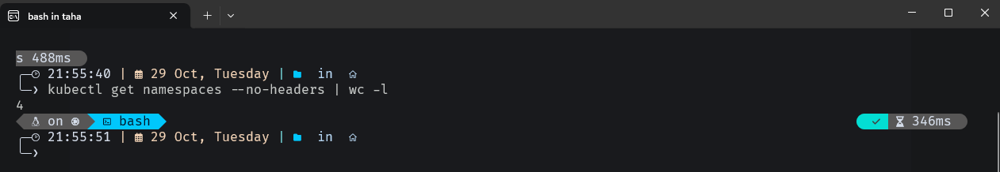

---

# 2. How many pods exist in the kube-system namespace?

To list pods in the `kube-system` namespace:
```bash
kubectl get pods -n kube-system
```
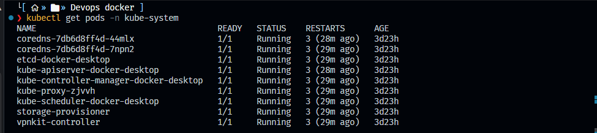

To count them:
```bash
kubectl get pods -n kube-system --no-headers | wc -l
```
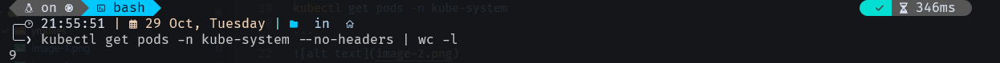

---

# 3. Create a deployment with the following specifications:

- **Name:** beta  
- **Image:** redis  
- **Replicas:** 2  
- **Namespace:** finance  
- **Resources Requests:**  
  - **CPU:** 500m  
  - **Mem:** 1G  
- **Resources Limits:**  
  - **CPU:** 1  
  - **Mem:** 2G  

You must create the namespace first:
```bash
kubectl create namespace finance
```

To create the deployment `beta` with the `redis` image and 2 replicas, define the CPU and memory requests and limits, and specify the namespace:
```yaml
apiVersion: apps/v1
kind: Deployment
metadata:
  name: beta
  namespace: finance
spec:
  replicas: 2
  selector:
    matchLabels:
      app: beta
  template:
    metadata:
      labels:
        app: beta
    spec:
      containers:
      - name: redis
        image: redis
        resources:
          requests:
            cpu: "500m"
            memory: "1Gi"
          limits:
            cpu: "1"
            memory: "2Gi"
```
Put the above YAML in the file `ymlfiles/q1/deployment_q1.yml`.

Apply this with:
```bash
kubectl apply -f ymlfiles/q1/deployment_q1.yml
```
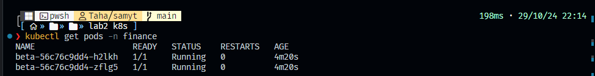

---

# 4. Label the Master Node with `color=blue`

To label the master node:
1. Get the node name:
   ```bash
   kubectl get nodes
   ```
   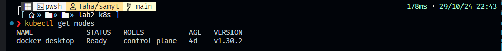

2. Label the node:
   ```bash
   kubectl label nodes docker-desktop color=blue
   ```
   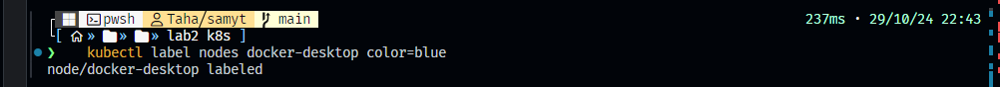

---

# 5. Create a new deployment named `blue` with the nginx image and 3 replicas.

Set Node Affinity to the deployment to place the pods on master only:  
- **NodeAffinity:** requiredDuringSchedulingIgnoredDuringExecution  
- **Key:** color  
- **Values:** blue  

Apply it:
```bash
kubectl apply -f ymlfiles/q2/deployment_q2.yml
```
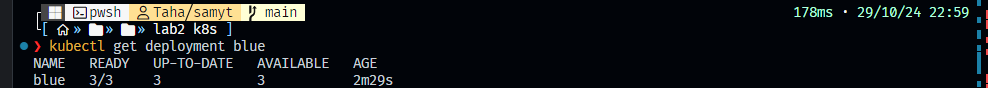

---

# 6. Create a namespace named “iti” with a resource quota on pods “2”.

To create a namespace with a pod quota limit of 2:
```bash
kubectl create namespace iti
```
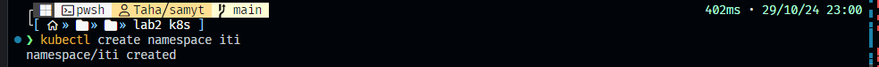

Then apply the resource quota:
```yaml
apiVersion: v1
kind: ResourceQuota
metadata:
  name: pod-quota
  namespace: iti
spec:
  hard:
    pods: "2"
```
Apply it:
```bash
kubectl apply -f ymlfiles/q3/ResourceQuota.yml
```
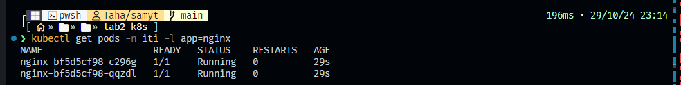

---

# 7. Create a deployment named "nginx" with image "nginx”, replicas 3 in the "iti” namespace.

To create a deployment with the `nginx` image and 3 replicas:
```yaml
apiVersion: apps/v1
kind: Deployment
metadata:
  name: nginx
  namespace: iti
spec:
  replicas: 3
  selector:
    matchLabels:
      app: nginx
  template:
    metadata:
      labels:
        app: nginx
    spec:
      containers:
      - name: nginx
        image: nginx
```
Apply it:
```bash
kubectl apply -f ymlfiles/q3/deployment_q3.yml
```
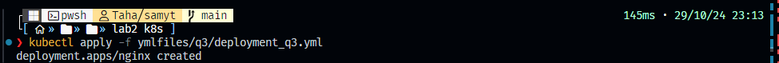

---

# 8. How many pods have been created within the nginx deployment and why?

To verify pod count:
```bash
kubectl get pods -n iti -l app=nginx
```

Since the `iti` namespace has a quota limiting the number of pods to 2, only 2 out of the requested 3 replicas will be created.


---

# 9. Create a LimitRange for the “gold” namespace with memory (limit: 500 Mi, request: 200 Mi).

First, we need to create the namespace `gold`:
```bash
kubectl create namespace gold
```
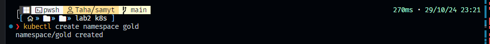

To create a `LimitRange` in the `gold` namespace:
```yaml
apiVersion: v1
kind: LimitRange
metadata:
  name: memory-limits
  namespace: gold
spec:
  limits:
  - max:
      memory: "500Mi"
    min:
      memory: "200Mi"
    type: Container
```
Apply it:
```bash
kubectl apply -f ymlfiles/q4/deployment_q4.yml
```
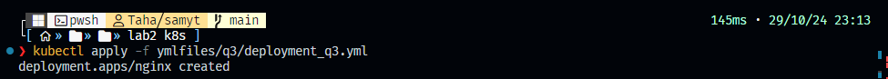

---

# 10. Create a pod named "ingot" in the "gold" namespace.

To create a pod named `ingot` in the `gold` namespace:
```yaml
apiVersion: v1
kind: Pod
metadata:
  name: ingot
  namespace: gold
spec:
  containers:
  - name: nginx
    image: nginx
```
Apply it:
```bash
kubectl apply -f ymlfiles/q5/deployment_q5.yml
```
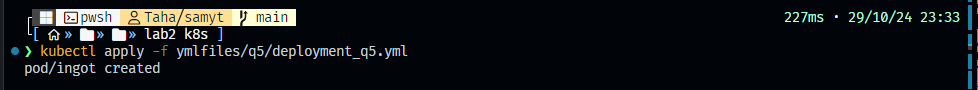

### Pod Details
```bash
kubectl describe pods -n gold
```
Output:
```
Name:             ingot
Namespace:        gold
Priority:         0
Service Account:  default
Node:             docker-desktop/192.168.65.3
Start Time:       Tue, 29 Oct 2024 23:35:29 +0300
Labels:           <none>
Annotations:      <none>
Status:           Running
IP:               10.1.0.47
IPs:
  IP:  10.1.0.47
Containers:
  nginx:
    Container ID:   docker://0bd9b8265941ec8de0d2864f3dea73003ba69c0ee612fb5d54447f9c78bd48d1
    Image:          nginx
    Image ID:       docker-pullable://nginx@sha256:28402db69fec7c17e179ea87882667f1e054391138f77ffaf0c3eb388efc3ffb  
    Port:           <none>
    Host Port:      <none>
    State:          Running
      Started:      Tue, 29 Oct 2024 23:35:32 +0300
    Ready:          True
    Restart Count:  0
    Environment:    <none>
    Mounts:
      /var/run/secrets/kubernetes.io/serviceaccount from kube-api-access-6dvnh (ro)
Conditions:
  Type                        Status
  PodReadyToStartContainers   True
  Initialized                 True
  Ready                       True
  ContainersReady             True
  PodScheduled                True
Volumes:
  kube-api-access-6dvnh:
    Type:                    Projected (a volume that contains injected data from multiple sources)
    TokenExpirationSeconds:  3607
    ConfigMapName:           kube-root-ca.crt
    ConfigMapOptional:       <nil>
    DownwardAPI:             true
QoS Class:                   BestEffort
Node-Selectors:              <none>
Tolerations:                 node.kubernetes.io/not-ready:NoExecute op=Exists for 300s
                             node.kubernetes.io/unreachable:NoExecute op=Exists for 300s
Events:
  Type    Reason     Age   From               Message
  ----    ------     ----  ----               -------
  Normal  Scheduled  69s   default-scheduler  Successfully assigned gold/ingot to docker-desktop
  Normal  Pulling    68s   kubelet            Pulling image "nginx"
  Normal  Pulled     66s   kubelet            Successfully pulled image "nginx" in 1.515s (1.515s including waiting). Image size: 72950530 bytes.
  Normal  Created    66s   kubelet            Created container nginx
  Normal  Started    66s   kubelet            Started container nginx
```
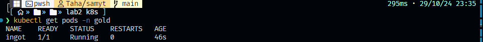
