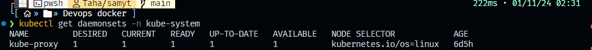

<p align="center">
  
</p>


# 1. How many DaemonSets are created in the cluster in all namespaces?
You can find the total number of DaemonSets by running the following command:
```bash
kubectl get daemonsets --all-namespaces
```
Count the number of lines in the output (excluding the header) to get the total count.


# 2. What DaemonSets exist in the kube-system namespace?
To list the DaemonSets in the `kube-system` namespace, use:
```bash
kubectl get daemonsets -n kube-system
```



# 3. What is the image used by the POD deployed by the kube-proxy DaemonSet?
To check the image used by the `kube-proxy` DaemonSet, run:
```bash
kubectl get daemonset kube-proxy -n kube-system -o=jsonpath='{.spec.template.spec.containers[*].image}'
```


# 4. Deploy a DaemonSet for Fluent D Logging.
        Use the given
        specifications.
        Name: elasticsearch
        Namespace: kube-system
        Image: k8s.gcr.io/fluentd-elasticsearch:1.20

```yaml
apiVersion: apps/v1
kind: DaemonSet
metadata:
  name: elasticsearch
  namespace: kube-system
spec:
  selector:
    matchLabels:
      name: elasticsearch
  template:
    metadata:
      labels:
        name: elasticsearch
    spec:
      containers:
        - name: elasticsearch
          image: k8s.gcr.io/fluentd-elasticsearch:1.20
```

Deploy it with:
```bash
kubectl apply -f ymlfiles/q1/deployment.yml
```


# 5. Deploy a pod named nginx-pod using the nginx:alpine image.
You can create the `nginx-pod` with the following command:
```bash
kubectl run nginx-pod --image=nginx:alpine --labels="tier=backend"
```


# 6. Deploy a test pod using the nginx:alpine image.
Run the test pod with:
```bash
kubectl run test-pod --image=nginx:alpine
```


# 7. Create a service backend-service to expose the backend application within the cluster on port 80.
You can expose the backend application with the following command:
```bash
kubectl expose pod nginx-pod --type=ClusterIP --name=backend-service --port=80 --target-port=80
```


# 8. Try to curl the backend-service from the test pod. What is the response?
First, execute a shell in the test pod:
```bash
kubectl exec -it test-pod -- /bin/sh
```


Then, run the curl command:
```bash
curl backend-service
```


# 9. Create a deployment named web-app using the image nginx with 2 replicas.
You can create the deployment using:
```yaml
apiVersion: apps/v1
kind: Deployment
metadata:
  name: web-app
spec:
  replicas: 2
  selector:
    matchLabels:
      app: web-app
  template:
    metadata:
      labels:
        app: web-app
    spec:
      containers:
        - name: nginx
          image: nginx
```
Deploy it with:
```bash
kubectl apply -f ymlfiles/q2/deployment2.yml
```

# 10. Expose the web-app as service web-app-service application on port 80 and nodeport 30082 on the nodes on the cluster.
To expose the deployment as a NodePort service, use:

```yml
apiVersion: v1
kind: Service
metadata:
  name: web-app-service
spec:
  type: NodePort
  ports:
    - port: 80
      targetPort: 80
      nodePort: 30082
  selector:
    app: web-app

```
and deploy it 

```bash
kubectl apply -f ymlfiles/q3/service_node_port.yml
```


# 11. Access the web app from the node.
You can access the web app using the node's IP address:
```
http://<node-ip>:30082 for my node ip is my local host so i will use http://127.0.0.1:30082
```


# 12. How many static pods exist in this cluster in all namespaces?
To find the number of static pods, run:
```bash
kubectl get pods --all-namespaces --field-selector=status.phase=Running -o wide | grep "kube-system" | wc -l
```

This will give you a count of running static pods.

# 13. On which nodes are the static pods created currently?
To find the nodes on which static pods are running, use:
```bash
kubectl get pods --all-namespaces -o wide | grep "kubelet"
```

