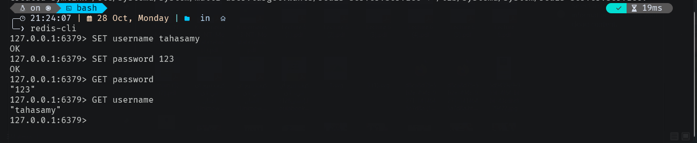
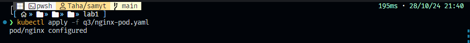
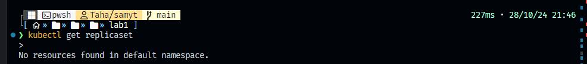

# 1. Create a Pod Named Redis with the Redis Image

To create the pod, use a `YAML` file with the following command:

```bash
kubectl apply -f q1/redis-pod.yml
```

## 1. Verify Pod Creation

Once the command above is executed, check the pod’s status with:

```bash
kubectl get pod
```


## 2. Accessing Redis

To access Redis, you can use a Kubernetes Service (Cluster Access). However, if this feels complex, **Port Forwarding (Local Access)** is a simpler alternative that allows direct local access to Redis.

Forward the Redis port to your local machine with:

```bash
kubectl port-forward pod/redis 6379:6379
```


## 3. Connecting to Redis

After port-forwarding, connect to Redis locally with:



> [!IMPORTANT]  
> You must install `redis-cli` to access Redis. If you haven’t installed it yet, [follow the instructions here](https://redis.io/docs/latest/operate/oss_and_stack/install/install-redis/).

---

# 2. Create a Pod with the name `nginx` and image `nginx123` using a YAML file

Apply the YAML file:

```bash
kubectl apply -f q2/nginx-pod.yaml
```


# 3. Check the nginx Pod Status

```bash
kubectl get pod nginx -o wide
```


# 4. Change the `nginx` Pod Image to `nginx` and Check the Status Again

1. Apply:

   ```bash
   kubectl apply -f q3/nginx-pod.yaml
   ```

   

2. Check the status:

   ```bash
   kubectl get pod nginx -o wide
   ```

   

# 5. Check the Number of ReplicaSets

Run:

```bash
kubectl get replicaset
```



# 6. Create a ReplicaSet (name: replica-set-1, image: busybox, replicas: 3)

1. Apply the YAML file:

   ```bash
   kubectl apply -f replica-set-1.yaml
   ```

   

# 7. Scale the ReplicaSet `replica-set-1` to 5 Pods

```bash
kubectl scale replicaset replica-set-1 --replicas=5
```


**Or**

Modify the replicas in the YAML file:


---

