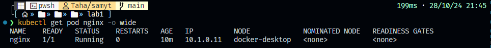
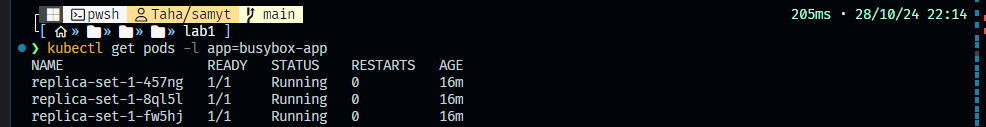
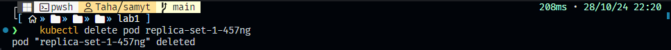
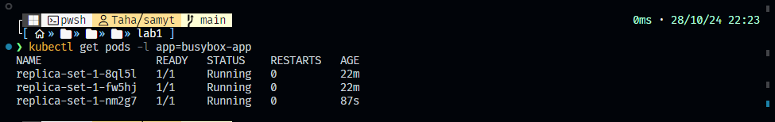
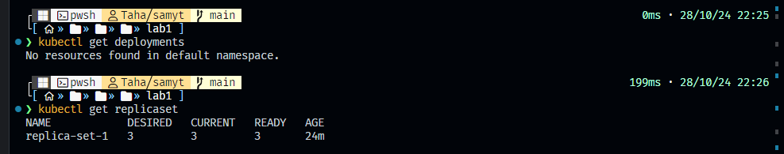
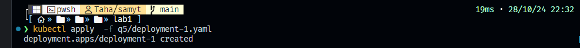
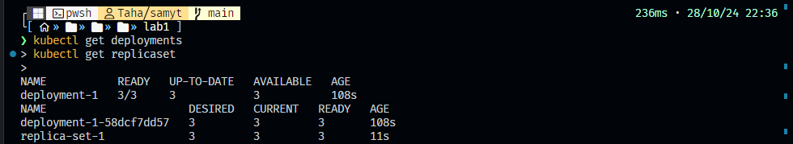
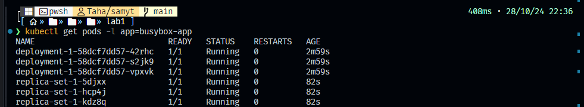
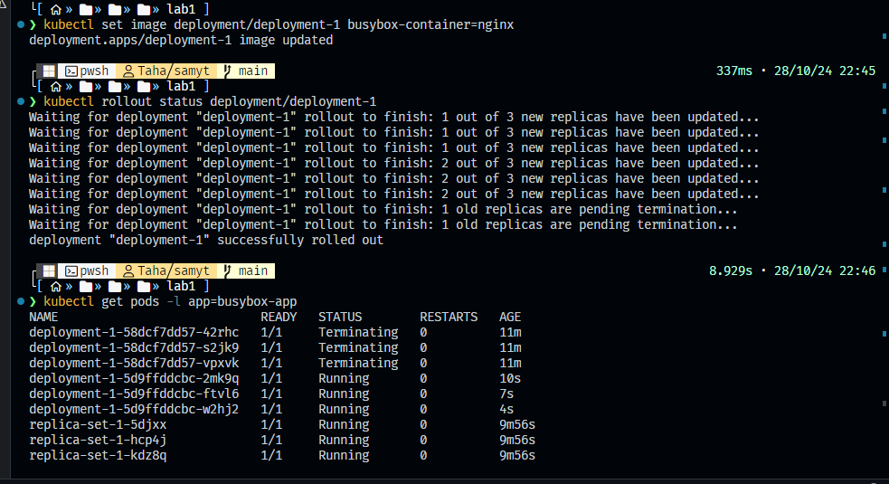
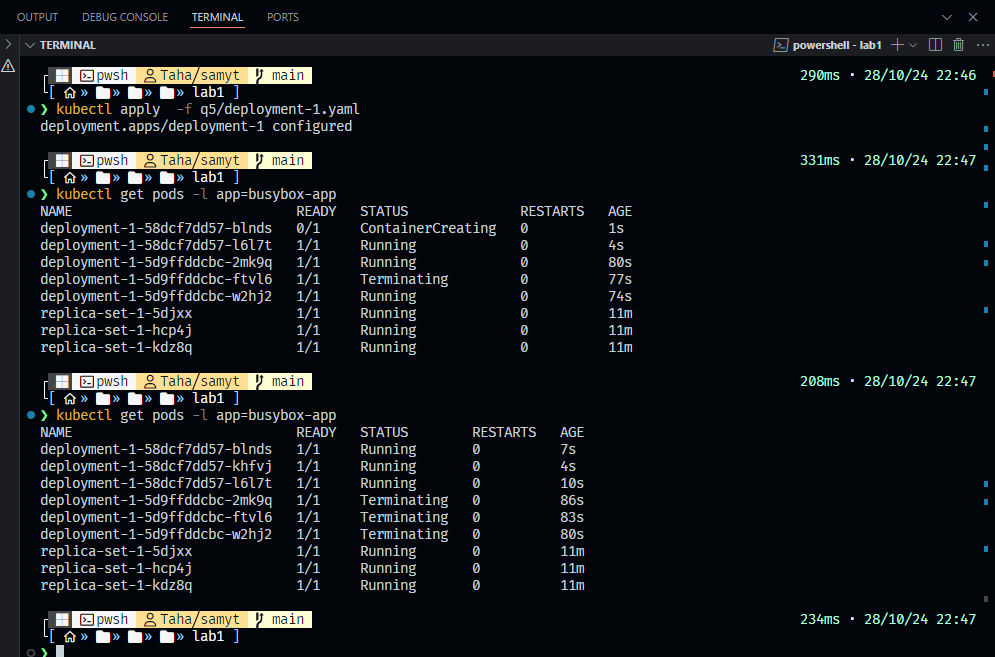

# 1. Create a Pod Named Redis with the Redis images/Image

To create the pod, use a `YAML` file with the following command:

```bash
kubectl apply -f q1/redis-pod.yml
```

## 1. Verify Pod Creation

Once the command above is executed, check the pod’s status with:

```bash
kubectl get pod
```


## 2. Accessing Redis

To access Redis, you can use a Kubernetes Service (Cluster Access). However, if this feels complex, **Port Forwarding (Local Access)** is a simpler alternative that allows direct local access to Redis.

Forward the Redis port to your local machine with:

```bash
kubectl port-forward pod/redis 6379:6379
```


## 3. Connecting to Redis

After port-forwarding, connect to Redis locally with:


> [!IMPORTANT]  
> You must install `redis-cli` to access Redis. If you haven’t installed it yet, [follow the instructions here](https://redis.io/docs/latest/operate/oss_and_stack/install/install-redis/).

---

# 2. Create a Pod with the name `nginx` and images/image `nginx123` using a YAML file

Apply the YAML file:

```bash
kubectl apply -f q2/nginx-pod.yaml
```


# 3. Check the nginx Pod Status

```bash
kubectl get pod nginx -o wide
```


# 4. Change the `nginx` Pod images/Image to `nginx` and Check the Status Again

1. Apply:

   ```bash
   kubectl apply -f q3/nginx-pod.yaml
   ```

   

2. Check the status:

   ```bash
   kubectl get pod nginx -o wide
   ```

   

# 5. Check the Number of ReplicaSets

Run:

```bash
kubectl get replicaset
```


# 6. Create a ReplicaSet (name: replica-set-1, images/image: busybox, replicas: 3)

1. Apply the YAML file:

   ```bash
   kubectl apply -f q4/replica-set-1.yaml
   ```

   

# 7. Scale the ReplicaSet `replica-set-1` to 5 Pods

```bash
kubectl scale replicaset replica-set-1 --replicas=5
```


**Or**

Modify the replicas in the YAML file:


---

---

# 9. Check the number of READY Pods in `replica-set-1`

```bash
kubectl get pods -l app=busybox-app
```


# 10. Delete one Pod from `replica-set-1` and check the total number of Pods

1. Delete a Pod:

   ```bash
   kubectl delete pod replica-set-1-457ng 
   ```
   

> [!IMPORTANT]  
> the name of pod is random so it will not work with you 

2. Check the number of Pods again:

   ```bash
   kubectl get pods -l app=busybox-app
   ```


   **Explanation**: ReplicaSets ensure the desired number of Pods remain running. When one Pod is deleted, the ReplicaSet immediately creates a new Pod to maintain the specified count.

---

### 11. Check the number of Deployments and ReplicaSets

```bash
kubectl get deployments
kubectl get replicaset
```


---

# 12. Create a Deployment (name = deployment-1,images/image = busybox,replicas = 3)

1. Apply the YAML file:

   ```bash
   kubectl apply -f q5/deployment-1.yaml
   ```


# 13. Check the number of Deployments and ReplicaSets

```bash
kubectl get deployments
kubectl get replicaset
```



---

# 14. Check the number of READY Pods for `deployment-1`

```bash
kubectl get pods -l app=busybox-app
```


---

# 15. Update the images/image in `deployment-1` to `nginx` and check the Pods

there are two ways

```bash
kubectl set images/image deployment/deployment-1 busybox-container=nginx
kubectl rollout status deployment/deployment-1
kubectl get pods -l app=busybox-app
```


**or**
modifiy on yml file and deploy on it

